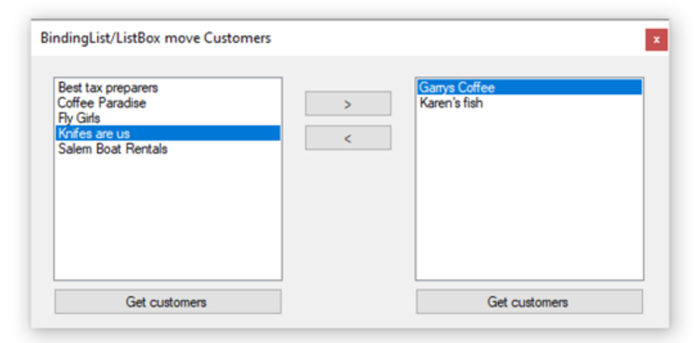
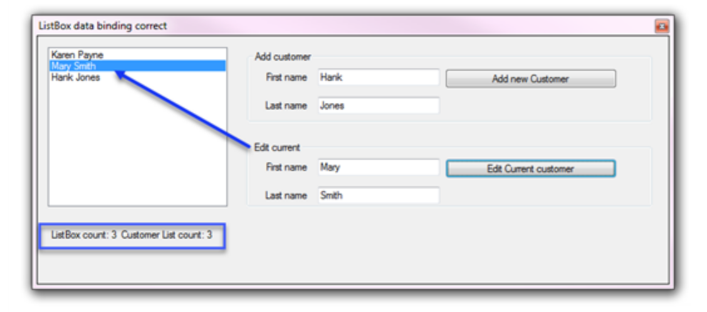
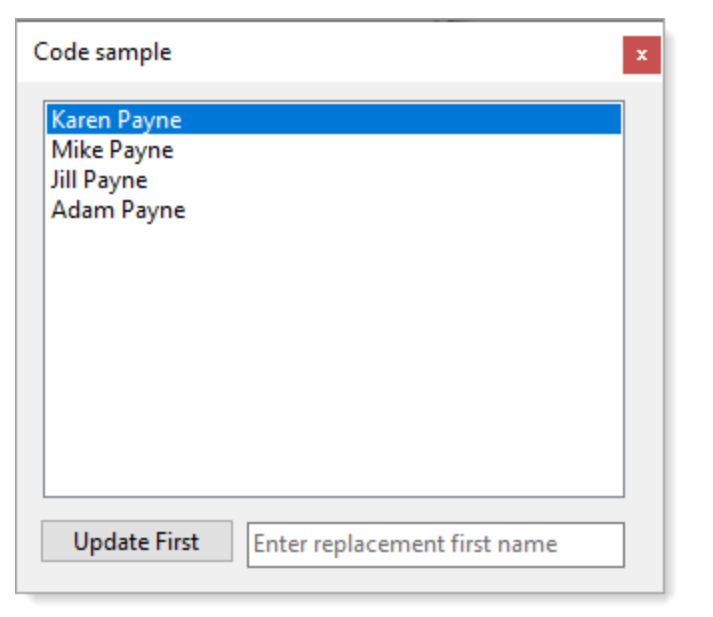
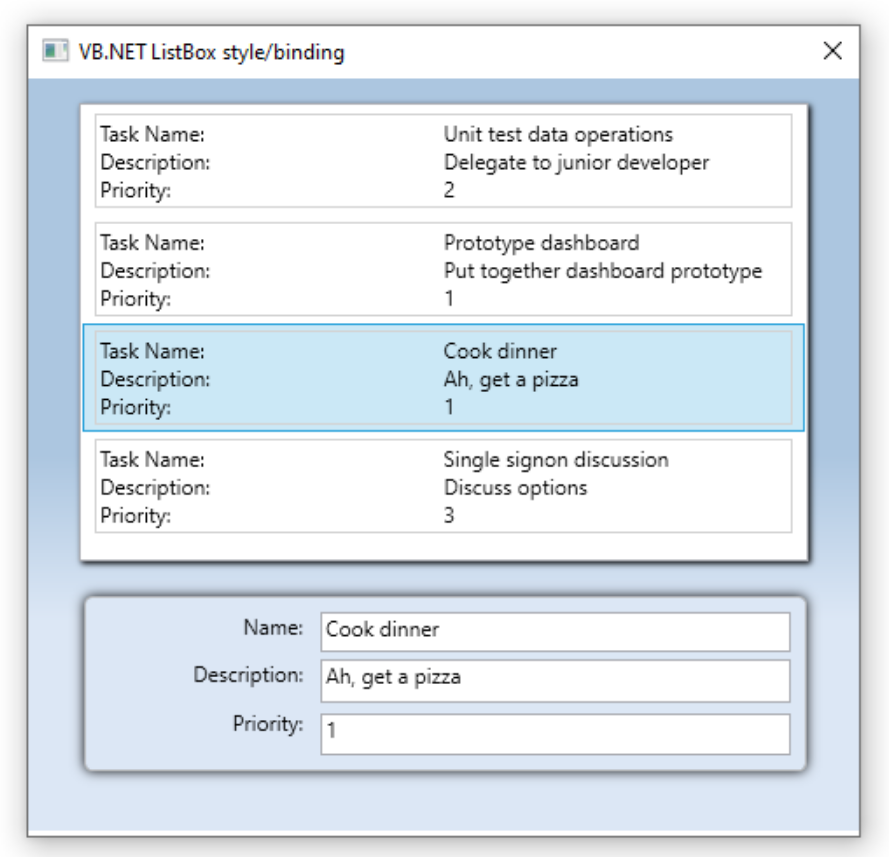

# Windows forms (C#): Data Binding ListBox/ComboBox

## Introduction
A common operation in desktop solutions is having a ComboBox or ListBox used to provide valid values for a property or field when adding or editing an object which may be a list of products for placing an order, country names for selecting a country are a few examples. Although on the surface this seems like providing values should be a five-minute task this is not the case when not understanding how to move forward which is the focus here.

# Basics
Novice developers tend to create a container (database table) that encompasses all there is to know about an object e.g. for a customer, first name, last name, street, city, state, country name. Then in code allow a user to add a new customer by inputting information into TextBox controls for first, last name, street, city and state while country names are presented in a ComboBox or ListBox as an array of string either hard coded which is the norm or have a reference table of country names. If a country name changes this creates a problem as all records in a database table need to be updated.

No matter what the list may be, a list of country names, product names, customer names the better solution is to treat each type with a primary key. For instance, selecting any of these objects from a list into a ComboBox or ListBox the view should be what is intended to allow users to select then beneath have a value which points to a primary key in a database table or reference table.


## Add items to ListBox and be visible

Provide an interface to move customers from one ListBox to another ListBox.



Data is read from a SQL-Server database using the [following class](https://github.com/karenpayneoregon/WinFormsDataBinding/blob/master/MoveBetweenListBoxes/Classes/SqlServerOperations.cs)  which returns a list of customers. Take the list and assign to the left ListBox then setup the right ListBox as a new list of customer followed by writing code for the buttons which are responsible for taking a selected customer and moving to the opposite ListBox using conventional code e.g. cast the SelectedItem to a Customer to a variable, add to the other ListBox and delete from the current ListBox. Unfortunately nothing appears in the opposite ListBox while the current ListBox selected item is removed. Many developers have tried to figure this out and failed simply because there is a lack of understanding how things work, it works with a DataGridView why not a ListBox or ComboBox? Simply answer, a DataGridView was designed to work with data while neither the ListBox or ComboBox were but can with proper understanding.

Another attempt may be to use two BindingSource components as the DataSource for each ListBox, this will fail but with a simple reset of the BindingSource can be forced to show newly added items e.g. SomeBindingSource.[ResetBindings](https://docs.microsoft.com/en-us/dotnet/framework/winforms/controls/reflect-data-source-updates-in-a-wf-control-with-the-bindingsource) . This means the current selected item is lost from the reset.

The final attempt, and proper method is to use a BindingList of Customer.

```csharp
public class Customer
{
    public int Identifier { get; set; }
    public string CompanyName
    public string ContactName { get; set; }
    public int ContactTypeIdentifier { get; set; }
    public int GenderIdentifier { get; set; }
    public override string ToString()
    {
        return CompanyName;
    }
}
```

**Form code**

Both ListBox controls use a BindingList<Customer> which a ListBox will reflect adding new items.

```csharp
using System;
using System.ComponentModel;
using System.Data;
using System.Linq;
using System.Windows.Forms;
using MoveBetweenListBoxes.Classes;
 
namespace MoveBetweenListBoxes
{
    public partial class CustomerForm : Form
    {
        public CustomerForm()
        {
            InitializeComponent();
            Shown += Form1_Shown;
        }
        private BindingList<Customer> _bindingListOriginalData =
            new BindingList<Customer>();
 
        private BindingList<Customer> _bindingListRight =
            new BindingList<Customer>();
 
        private async void Form1_Shown(object sender, EventArgs e)
        {
 
            var ops = new SqlServerOperations();
 
            _bindingListOriginalData =
                new BindingList<Customer>(await ops.CustomersList());
 
            listBox1.DataSource = _bindingListOriginalData;
             
            listBox2.DataSource = _bindingListRight;
            listBox2.DisplayMember = "CompanyName";
 
            listBox1.DoubleClick += ListBox1_DoubleClick;
            listBox2.DoubleClick += ListBox2_DoubleClick;
        }
 
 
        private void ListBox1_DoubleClick(object sender, EventArgs e)
        {
            MoveFromLeftToRight();
        }
        private void ListBox2_DoubleClick(object sender, EventArgs e)
        {
            MoveFromRightToLeft();
        }
 
        private void MoveItemLeftToRightButton_Click(object sender, EventArgs e)
        {
            MoveFromLeftToRight();
        }
 
        private void MoveItemRightToLeftButton_Click(object sender, EventArgs e)
        {
            MoveFromRightToLeft();
        }
 
        private void MoveFromLeftToRight()
        {
            if (_bindingListOriginalData.Count != 0)
            {
                _bindingListRight.Add((Customer)listBox1.SelectedItem);
                _bindingListOriginalData.Remove((Customer)listBox1.SelectedItem);
            }
        }
 
        private void MoveFromRightToLeft()
        {
            if (_bindingListRight.Count != 0)
            {
                var cust = (Customer)listBox2.SelectedItem;
                _bindingListOriginalData.Add(cust);
                _bindingListRight.Remove(cust);
            }
        }
        /// <summary>
        /// Names are un ordered but can be ordered via OrderBy
        /// </summary>
        /// <param name="sender"></param>
        /// <param name="e"></param>
        private void GetCustomersButton1_Click(object sender, EventArgs e)
        {
            var results = _bindingListOriginalData.Select(customer => customer.CompanyName);
            if (!results.Any())
            {
                MessageBox.Show("List is empty");
            }
            else
            {
                MessageBox.Show(string.Join("\n", results));
            }
        }
 
        private void GetCustomersButton2_Click(object sender, EventArgs e)
        {
            var results = _bindingListRight.Select(customer => customer.CompanyName);
 
            if (!results.Any())
            {
                MessageBox.Show("List is empty");
            }
            else
            {
                MessageBox.Show(string.Join("\n", results));
            }
 
        }
    }
}
```

The above resolves how to update a ListBox or ComboBox when new items are added.


## Edit Items in ListBox and be seen

Using the same methods above to add items needs additional logic to permit editing items in a ListBox or ComboBox, in this case implementing INotifyPropertyChanged  Interface. In code samples provides a slightly different version of implementation is used in most cases by adding JetBrains.Annotations  NuGet package Jump . Not interested in JetBrains.Annotations, no problem, using the conventional implementation of  INotifyPropertyChanged works well too, JetBrains simply makes it easier to write change notification for intended properties to work with change notification.

Note, when working with EF Core 5 or higher consider using [ObservableCollectionExtensions.ToBindingList](https://learn.microsoft.com/en-us/dotnet/api/microsoft.entityframeworkcore.observablecollectionextensions.tobindinglist?view=efcore-5.0)  which is a language extension that handles notification changes.

The class is different from the above example along with the user interface as in this example focus is on adding new items along with editing existing customers in a single ListBox.


```csharp
public class Customer : INotifyPropertyChanged
{
    private string _firstName;
    private string _lastName;
    public int Id { get; set; }
 
    public string FirstName
    {
        get => _firstName;
        set
        {
            if (value == _firstName) return;
            _firstName = value;
            OnPropertyChanged();
 
        }
    }
 
    public string LastName
    {
        get => _lastName;
        set
        {
            if (value == _lastName) return;
            _lastName = value;
            OnPropertyChanged();
 
        }
    }
 
    public string FullName => $"{FirstName} {LastName}";
    public override string ToString()
    {
        return $"{FirstName}, {LastName}";
    }
 
    public event PropertyChangedEventHandler PropertyChanged;
 
    [NotifyPropertyChangedInvocator]
    protected virtual void OnPropertyChanged(
        [CallerMemberName] string propertyName = null)
    {
        PropertyChanged?.Invoke(this, new PropertyChangedEventArgs(propertyName));
    }
}
```

Sample user interface provides adding and editing.



## Additional code samples

- Demonstrates conventional data binding between DataGridView and TextBox controls with BindingSource: [project](https://github.com/karenpayneoregon/WinFormsDataBinding/tree/master/Example1).
- Demonstrates conventional data binding with TextBox controls using BindingSource, DataTable, BindingNavigator: [project](https://github.com/karenpayneoregon/WinFormsDataBinding/tree/master/BindingSourceAddingNew).
- Using Entity Framework Core 5 [ToBindingList](https://learn.microsoft.com/en-us/dotnet/api/microsoft.entityframeworkcore.observablecollectionextensions.tobindinglist?view=efcore-5.0) see the following GitHub [repository](https://github.com/karenpayneoregon/efcore-datagridview-ToBindingList).



```csharp
public partial class OtherControlsForm : Form
{
    private readonly BindingSource _bindingSource = new();
    public OtherControlsForm()
    {
        InitializeComponent();
         
        Shown += OnShown;
    }
 
    private async void OnShown(object? sender, EventArgs e)
    {
        _bindingSource.DataSource = await DataOperations.PeopleLocal();
 
        listBox1.DisplayMember = "FullName";
        listBox1.DataSource = _bindingSource;
    }
 
    private void UpdateFirstNameButton_Click(object sender, EventArgs e)
    {
 
        if (!string.IsNullOrWhiteSpace(FirstNameTextBox.Text))
        {
            ((Person)_bindingSource.Current).FirstName = FirstNameTextBox.Text;
        }
        else
        {
            MessageBox.Show("Requires a first name");
        }
    }
}
```

## Deep dive

The following project demonstrates how to experiment with various permutations for binding to controls were a single Person class is used in three separate name spaces and worked on in a single form. What can be learn from this project is how to experiment  with many versions of the same class without having to write one, modifying it then trying a new version one or more times then figure out how to compare versions.

### Important points

- Making use of using aliasing to distinguish between different versions of the same class were each version are stored in different folders in the same project.
- Implementing an Interface between the three classes which allow casting any instances of the class to get at common properties. 

### Bonus classes

A secondary example to show what has been taught here works on standard .NET Framework classes. In the same project a ComboBox is populated with standard colors displayed by color name and methods to dynamically change names which are reflected in the original list.


```csharp
using System.Collections.Generic;
using System.Drawing;
using System.Linq;
using System.Reflection;
using CommonPractice.BaseNotifyClasses;
 
namespace CommonPractice.HelperClasses
{
    public class SysColors
    {
        /// <summary>
        /// Get a full list of colors available
        /// </summary>
        /// <returns></returns>
        public static List<Color> ColorStructToList()
        {
 
            return typeof(Color)
                .GetProperties(BindingFlags.Static | BindingFlags.DeclaredOnly |
                               BindingFlags.Public)
                .Select(c => (Color)c.GetValue(null, null))
                .ToList();
 
        }
        /// <summary>
        /// Get colors beginning with one or more characters
        /// </summary>
        /// <param name="sender"></param>
        /// <returns></returns>
        public static List<ColorItem> ColorsBeginningWith(string sender)
        {
 
            return ColorStructToList()
                .Where(color => color.Name.StartsWith(sender))
                .Select(color => new ColorItem() {Name = color.Name, Color = color}).ToList();
 
        }
    }
}
```

Setting up ComboBoxes

```csharp
private void SetupColorComboBoxes()
{
    // add colors starting with the letter A
    ColorsComboBox1.DataSource = ColorsBeginningWith("A");
 
    // add colors starting with B, will not show up
    var bColors = ColorsBeginningWith("B");
    ((List<nf.ColorItem>)ColorsComboBox1.DataSource).AddRange(bColors.ToArray());
 
    /*
     * We need to use a BindingList to allow a ComboBox to recognize new
     * items added.
     */
    var bColorList = new BindingList<nf.ColorItem>(ColorsBeginningWith("A"));
 
    ColorsComboBox2.DataSource = bColorList;
    bColorList.AddColors(bColors);
 
}
```

Changing current item

```csharp
private void ChangeCurrentColorButton_Click(object sender, EventArgs e)
{
    if (!string.IsNullOrWhiteSpace(ColorNameTextBox.Text) && ColorsComboBox2.Items.Count >0)
    {
        // this will be updated in the ComboBox using a BindingList
        ((nf.ColorItem)ColorsComboBox2.SelectedItem).Name = ColorNameTextBox.Text;
 
        // this will update the backing list but not the ComboBox
        ((nf.ColorItem)ColorsComboBox1.SelectedItem).Name = ColorNameTextBox.Text;
    }
}
```

WPF Operations
When working with WPF ListBox and other controls the way to take care of the same operations mentioned above is to implement two-way binding in tangent with INotifyPropertyChanged, using triggers  or using ObservableCollection&lt;T>.



## Summary
Information provided can greatly reduce what it takes to data bind between concrete list of classes to ListBox and ComboBox controls in Windows forms desktop solutions written with Visual Studio with C# programming language.  Note in the project ConventionalDataGridViewTextBoxBinding C# 7 or higher is required for the following [code](https://github.com/karenpayneoregon/WinFormsDataBinding/blob/master/Example1/Form1.cs#L38).