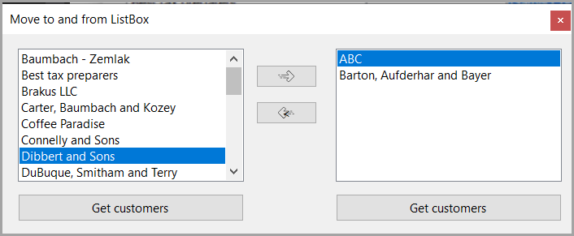

This repository is for teaching dynamic data binding for WinForms.

[TechNet article](https://social.technet.microsoft.com/wiki/contents/articles/53599.data-binding-listboxcombobox-in-windows-forms-c.aspx) which is going away 01/2024 so I copied the article to [here](https://github.com/karenpayneoregon/WinFormsDataBinding/blob/master/article.md).

